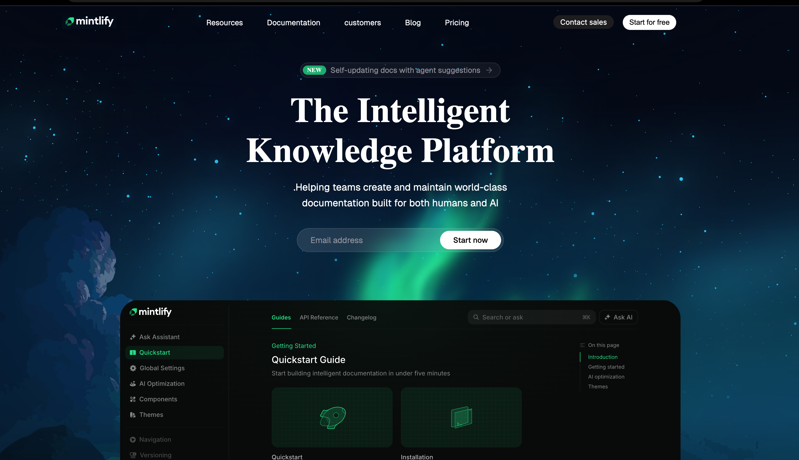

# Mintlify Clone

A modern, responsive landing page inspired by Mintlify's design, built with vanilla HTML, CSS, and TypeScript.



## ✨ Features

- **Modern UI Design** - Clean, professional interface with glassmorphism effects
- **Responsive Layout** - Optimized for all screen sizes
- **Interactive Elements** - Hover effects and smooth transitions
- **Custom Typography** - Using Geist and Inter fonts for a polished look
- **Dark Theme** - Sleek dark mode design with gradient backgrounds

## 🚀 Tech Stack

- **HTML5** - Semantic markup
- **CSS3** - Custom styling with modern features (backdrop-filter, flexbox)
- **TypeScript** - Type-safe development
- **Vite** - Fast build tool and dev server
- **Tailwind CSS v4** - Utility-first CSS framework

## 📦 Installation

```bash
# Install dependencies
npm install
# or
bun install
```

## 🛠️ Development

```bash
# Start development server
npm run dev
```

Visit `http://localhost:5173` to view the project.

## 🏗️ Build

```bash
# Build for production
npm run build

# Preview production build
npm run preview
```

## 📁 Project Structure

```
mintlify_clone/
├── public/              # Static assets
│   ├── background_image.svg
│   ├── hero-image-dark.svg
│   └── Screenshot 2026-02-07 at 11.13.07 AM.png
├── src/
│   ├── style.css       # Main stylesheet
│   └── vite.config.ts  # Vite configuration
├── index.html          # Entry point
└── package.json        # Dependencies
```

## 🎨 Key Components

- **Navigation Bar** - Fixed header with logo and action buttons
- **Hero Section** - Eye-catching headline with email signup
- **Badge Component** - Animated "NEW" feature badge
- **Email Input** - Glassmorphic input with CTA button

## 📝 License

This is a clone project for educational purposes.
